<!-- ================================== -->
<!--        Aman Kumar Pandey           -->
<!-- ================================== -->

  

<h1 align="center">Aman Kumar Pandey</h1>

  Automation Engineer • Systems Integrator • Open Source Developer

---

## 🧠 About

I build automation-driven software with a focus on performance, reliability, and clean architecture.

My work centers around:

- 🤖 Browser and messaging automation  
- 📱 macOS and Android integration  
- ⚙️ Productivity tooling  
- 🧩 Modular system design  
- 🚀 Developer-focused Python libraries  

I prioritize typed code, documentation, and production-grade stability.

---

## 🚀 Projects

### 🔥 Astra Engine Research

A high-performance WhatsApp Web automation library for Python built on Playwright.

Key characteristics:

- 🖥 Real browser control (no reverse-engineered protocols)  
- 🔗 Multi-Device support  
- 📲 Phone number pairing  
- 💬 Messaging, media, polls, reactions, and group management  
- 🔄 Real-time event handling  
- 🧠 Fully typed and documented  

Documentation:  
https://astra-engine.readthedocs.io/

---

### ⚙️ Axone

A cross-platform integration engine connecting macOS and Android devices.

Core focus:

- 🔌 Device control utilities  
- 📡 ADB integration  
- 🔄 Workflow automation  
- 💻 Desktop-to-mobile productivity bridge  

---

### 🛠 Windows-Optimizer

A system optimization toolkit for Windows environments.

- 🧹 Automated cleanup  
- ⚡ Performance tuning  
- 📊 Maintenance scripting  

---

### 🎙 Vaani

A context-aware voice assistant focused on automation and intelligent command execution.

---

### 🔧 X

A modular Telegram userbot ecosystem built with plugin-based architecture.

---

## 🛠 Tech Stack

### 👨‍💻 Languages

  
  
  
  

### ⚙️ Frameworks & Libraries

  
  
  

### 🗄 Databases

  
  
  
  

### 🚀 DevOps & Systems

  
  
  

---

## 📊 GitHub Statistics

  
  

---

## 📬 Contact

  
  
  
  

---

  Built with ❤️ by Aman Kumar Pandey

---

<!-- PROFILE-ENGINE-START -->
Realtime profile engine status: active
Last sync: 
<!-- PROFILE-ENGINE-END -->

---

## Activity

  

